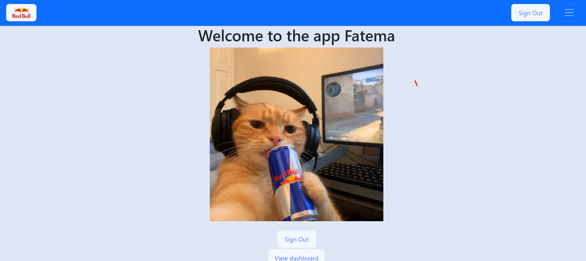

# Redbull Hub 🥂

### How to Use the app

-create a a new account or sign in if you have one
-browse the redbulls from the redbull icon in the nav bar 
- browse the redbulls
- add redbulls 
-browse the recipes 
-crate your own recipe so to share it with people and review their feedback on your recipe or others recipes 

### Installation
-clone the repository
-install those packages

bcrypt-cloudinary-connect-mongo-dotenv-ejs-express-express-session-method-override-mongoose-morgan-multer

### Technologies Used

- **HTML**
- **CSS**
- **JavaScript**
- **ejs**

### Future Enhancements

- adding more types not just the redbull to have more options in the recipes 

### Credits

Zainab , Bidoor and Nabila thank you for the help throughout this project ❤️

### Contributing

Feel free to fork this repository and submit pull requests to contribute to the development of redbull-hub-project. For major changes, please open an issue first to discuss what you would like to change.

